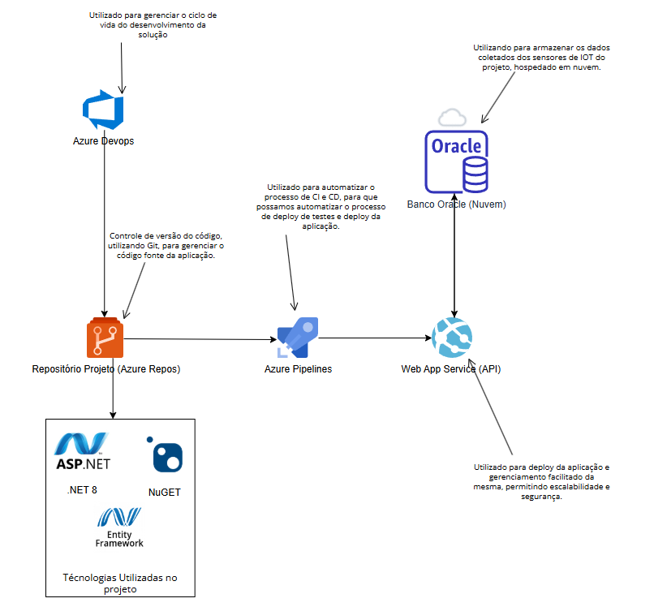

## Breve Descrição da Solução Proposta  
O **EcoSynergy** é um sistema de monitoramento de painéis solares ligado à inteligência artificial (IA). Este sistema inicial tem a IA ajustada para exibir um relatório simples, e o prompt será personalizado para cada cliente, permitindo que ele escolha como deseja visualizar as informações. O retorno da IA será integrado ao nosso front-end futuramente, permitindo a visualização de dados de consumo e eficiência energética de maneira dinâmica e personalizada.

## Arquitetura Implementada

## Benefícios Alcançados para o Negócio  

1. **Redução de Custos com Energia**: Aumenta o uso da energia solar gerada, reduzindo a dependência da rede elétrica e as despesas com energia.  
2. **Sustentabilidade e Eficiência**: Contribui para práticas sustentáveis, otimizando recursos e reduzindo desperdícios de energia.  
3. **Automação Inteligente**: Automatiza o gerenciamento do consumo energético, promovendo maior comodidade e eficiência no uso dos dispositivos domésticos.
4. **Engajamento do Usuário**: Proporciona monitoramento em tempo real e maior controle ao usuário, melhorando a experiência e o engajamento.

## JSON Para execução das tabelas

###  DadoSensor

{
  "id": 0,
  "timestamp": "2024-11-22T02:12:50.085Z",
  "valorLuminosidade": 0,
  "nomeSensor": "string"
}

### Painel 

{
  "id": 0,
  "nome": "string",
  "producaoMedia": 0
}

### Producao 

{
  "id": 0,
  "timestamp": "2024-11-22T02:14:06.380Z",
  "potenciaGerada": 0,
  "temperaturaAmbiente": 0,
  "dadosLuminosidade": {
    "id": 0,
    "timestamp": "2024-11-22T02:14:06.380Z",
    "valorLuminosidade": 0,
    "nomeSensor": "string",
    "producaoEnergiaId": 0
  },
  "paineis": [
    {
      "id": 0,
      "nome": "string",
      "producaoMedia": 0
    }
  ]
}

## Print da tarefa Finalizada

## Script para criação de recursos no Azure

az group create --name ecosynergy --location brazilsouth && az appservice plan create -n planEcosynergy --location brazilsouth -g ecosynergy --sku F1 && az webapp create -g ecosynergy -p planEcosynergy --runtime "DOTNET:8" -n ecosynergy-api
